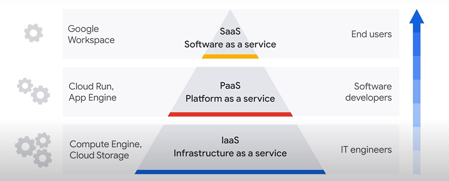

Three types of cloud computing service models:

1. **IaaS** - Infrastructure as a service offers compute and storage services.
2. **PaaS** - Platform as a service offers a develop-and-deploy environment to build cloud apps.
3. **SaaS** - Software as a service delivers apps as services; users get access to software on a subscription basis.

Cloud computing allows for a **third party** to **be responsible** for **some part** of the infrastructure.

## IaaS (Infrastructure as a Service)

- computing model that offers on-demand availability of infrastructure resources, such as compute, networking storage, and databases as services over the internet
- provides same technologies and capabilities as a traditional data center
- IaaS resources are offered as individual services, organizations can choose what they need.
- **Compute Engine** (run virtual machines) and **Cloud Storage** (store any type of data) are examples of Google Cloude IaaS products

### IaaS benefits

- **it's economical** - resources being used on demand, costs are predictable
- **it's efficient** - resources being regularly available when you need them, with fewer delays
- **it boosts productivity** - oranizations' IT departments can save time and money because the cloud provider is responsible for setting up and maintaining the physical infrastructure
- **it's reliable** - not having a single point of failure
- **it's scalable** - allowing to scale resources up and down rapidly according to business needs.

## PaaS (Platform as a Service)

- **provides a platform** for developers to develop, run, manage their own apps
- **no need to build and maintain** the associated infrastructure
- **can use built-in software components** to build applications
- **reduces amount of code**

**Cloud Run** and **Big Query** are examples of **Google Cloud PaaS** products:
- **Cloud Run** is a fully managed, serverless platform for developing and hosting applications at scale
- **Big Query** is a fully managed enterprise data warehouse that manages and analyzes data, and can be queried.

### PaaS benefits

- **it reduces development time** - developers can go straight to coding instead of spending time on setting up development environments
- **it's scalable** - allowing the purchase of additional capacity for building, testing, staging, running applications
- **it reduces management** - by abstracting the management of underlying resources
- **it's flexible** - by having support for different programming languages and easy collaboration for distributed teams

## SaaS (Software as a Service)

Software as a Service is a computing model that offers an entire application, managed by a cloud provider, through a web browser. Organizations simply pay a subscription fee for access to ready-to-use software products.

**Google Workspace**, with tools like Gmail, Google Drive, Google Docs, Google Meet, is a **Google Cloud Saas product**.

### SaaS benefits

- **low maintenance** - eliminating the need to have IT staff
- **cost-effective** - based on a subscription model with fixed monthly or annual account fee
- **flexible** - once logged in, everything is available over the internet, no matter the device used

## Choosing the right cloud computing model

- **IaaS** is a highly flexible, scalable service, while maintaining control of infrastructure.
- **PaaS** is a platform designed for building software products.
- **SaaS** is good if you want ready to use features, without the hassle of installations.

Depending on the use case, most organizations will use combinations of all three to solve for different business needs.

## The shared responsibility model

**Security** in the cloud is a **shared responsibility** between the **cloud provider** and the **customer**.

The cloud provider is responsible for the **security of the cloud** (hardware, networks, physical security), while the customer is responsible for the **security in the cloud** (configurations, access policies, user data).

![[shared-responsibility.png]]

Customers are always responsible for the security of **their data**.